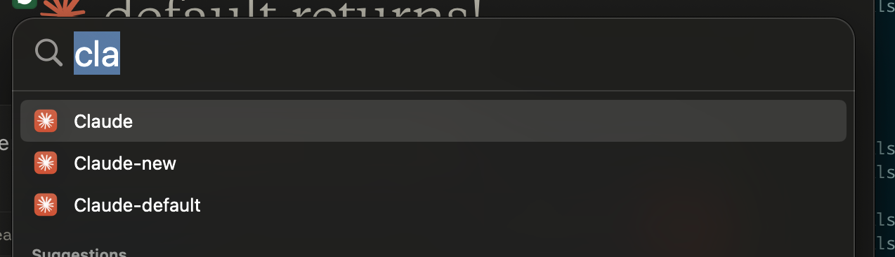

# Claude Desktop Multi-Instance Launcher

> 🚀 Run multiple Claude Desktop instances simultaneously on macOS with independent configurations, accounts, and MCP server settings

## 📸 Screenshots

### Multi-Window Running Effect


### Spotlight Search Integration


*Use Spotlight (⌘+Space) to quickly find and launch different Claude instances. Each app wrapper shows up as a separate application that maintains its login state and configuration.*

### Custom Display Names in Dock
 

*When hovering over icons in the Dock, each instance displays its own custom name instead of just "Claude"*

## ✨ Features

- 🔄 **Multi-Instance Management** - Run multiple independent Claude Desktop instances on the same machine
- 🏷️ **Custom Display Names** - Show different app names in Dock (e.g., "Claude Work", "Claude Personal")
- ⚙️ **Independent Configurations** - Each instance has its own MCP server config and login credentials
- 📱 **App Wrappers** - Create independent app icons for direct Launchpad access
- 🔍 **Spotlight Integration** - Find and launch instances quickly using Spotlight search (⌘+Space)
- 🛠️ **Smart Diagnostics** - Built-in problem diagnosis and repair tools
- 💡 **User-Friendly** - Both interactive menu and command-line interfaces

## 📋 System Requirements

- macOS 11 (Big Sur) or later
- Claude Desktop app (download from [claude.ai/download](https://claude.ai/download))
- Bash shell (built into macOS)

## 🚀 Quick Start

### 1. Download and Setup

```bash
# Clone the repository
git clone https://github.com/weidwonder/claude-desktop-multi-instance.git
cd claude-desktop-multi-instance

# Make script executable
chmod +x claude_quick.sh
```

Or download the script directly:

```bash
# Download single script file
curl -O https://raw.githubusercontent.com/weidwonder/claude-desktop-multi-instance/main/claude_quick.sh
chmod +x claude_quick.sh
```

### 2. First Use

```bash
# Run script to show menu
./claude_quick.sh

# Or directly create and launch an instance
./claude_quick.sh work
```

## 📖 Usage Guide

### Interactive Menu Mode

Run `./claude_quick.sh` to display the menu:

```
======================================
    Claude Desktop Quick Launcher
======================================

Available options:
1. Launch default instance
2. Select existing instance
3. Create new instance
4. Delete specified instance
5. Create app wrapper (independent icon)
6. Restore original configuration
7. Diagnose problems
8. Fix wrappers
```

### Command Line Mode

```bash
# Launch or create instance
./claude_quick.sh [instance_name]

# Management commands
./claude_quick.sh list                 # List all instances
./claude_quick.sh delete [instance]    # Delete instance
./claude_quick.sh wrapper [instance]   # Create app wrapper
./claude_quick.sh diagnose             # Diagnose problems
./claude_quick.sh fix                  # Fix wrappers
./claude_quick.sh restore              # Restore original config
```

## 💼 Use Cases

### Scenario 1: Separate Work and Personal Accounts

```bash
# Create work instance
./claude_quick.sh work
# Login with work account, configure work-related MCP servers

# Create personal instance
./claude_quick.sh personal
# Login with personal account, configure personal MCP servers
```

### Scenario 2: Different Project Configurations

```bash
# Project A - with filesystem and web search MCP
./claude_quick.sh project-a

# Project B - with database and API MCP
./claude_quick.sh project-b

# Development environment - with Git and testing tools MCP
./claude_quick.sh dev
```

### Scenario 3: Create App Wrappers

```bash
# Create independent app icon for work instance
./claude_quick.sh wrapper work
# Enter display name: Claude Work

# Now you can launch "Claude Work" directly from Launchpad or Spotlight
# It will show as "Claude Work" instead of "Claude" in Dock
# Each wrapper maintains its own login state and configuration
```

## 📁 File Structure

```
~/.claude-instances/                    # Instance data directory
├── work/                              # Work instance
│   └── Application Support/Claude/
│       └── claude_desktop_config.json
├── personal/                          # Personal instance
│   └── Application Support/Claude/
│       └── claude_desktop_config.json
└── scripts/                           # Helper scripts
    ├── restore.sh                     # Quick restore config
    └── list.sh                        # List all instances

/Applications/                          # App wrappers
├── Claude.app                         # Original app
├── Claude-work.app                    # Work instance wrapper
└── Claude-personal.app                # Personal instance wrapper
```

## 🔧 Troubleshooting

### Issue: App wrapper won't launch

**Solution:**
```bash
# 1. Run diagnostics
./claude_quick.sh diagnose

# 2. Fix wrappers
./claude_quick.sh fix

# 3. If still not working, recreate
rm -rf /Applications/Claude-work.app
./claude_quick.sh wrapper work
```

### Issue: Claude Desktop not found

**Solution:**
1. Ensure Claude Desktop is downloaded and properly installed from [claude.ai/download](https://claude.ai/download)
2. Confirm the app is located at `/Applications/Claude.app`
3. Run `./claude_quick.sh diagnose` to check installation status

### Issue: Instance configuration lost

**Solution:**
```bash
# Restore original configuration
./claude_quick.sh restore

# Check backup files
ls -la ~/Library/Application\ Support/Claude.backup.*
```

### Issue: Icon display problems

**Solution:**
```bash
# Fix icons
./claude_quick.sh fix

# Or recreate app wrapper
./claude_quick.sh wrapper [instance_name]
```

## 📊 Command Reference

| Command | Description | Example |
|---------|-------------|---------|
| `./claude_quick.sh` | Show interactive menu | `./claude_quick.sh` |
| `./claude_quick.sh [instance]` | Launch or create instance | `./claude_quick.sh work` |
| `./claude_quick.sh list` | List all instances | `./claude_quick.sh list` |
| `./claude_quick.sh delete [instance]` | Delete specified instance | `./claude_quick.sh delete old` |
| `./claude_quick.sh wrapper [instance]` | Create app wrapper | `./claude_quick.sh wrapper work` |
| `./claude_quick.sh diagnose` | Diagnose problems | `./claude_quick.sh diagnose` |
| `./claude_quick.sh fix` | Fix wrappers | `./claude_quick.sh fix` |
| `./claude_quick.sh restore` | Restore original config | `./claude_quick.sh restore` |

## 🔒 Security Considerations

1. **Configuration Backup**: Script automatically backs up original configs, but manual backups are recommended
2. **Sensitive Information**: Each instance stores login information independently
3. **Permission Control**: App wrappers use the same permissions as original Claude app
4. **Data Isolation**: Different instances' data is completely isolated

## ❓ Frequently Asked Questions

**Q: Can I run multiple instances simultaneously?**  
A: No. macOS limits to one Claude Desktop instance at a time, but you can quickly switch between them.

**Q: Will chat history sync between instances?**  
A: No. Different instances use different accounts, so chat history won't sync.

**Q: How do I backup instance configurations?**  
A: Copy the `~/.claude-instances/[instance_name]` directory to backup the entire instance configuration.

**Q: Can I import/export MCP configurations?**  
A: Yes. Copy the `claude_desktop_config.json` file to share MCP configurations between instances.

## 🤝 Technical Support

If you encounter issues:

1. First run `./claude_quick.sh diagnose` for automatic diagnosis
2. Check the troubleshooting section in this document
3. Ensure Claude Desktop app is the latest version
4. Check macOS system version compatibility

## 📄 License

MIT License - Free to use and modify

---

> 💡 **Tip**: This tool is especially useful for users who need to manage multiple Claude accounts or different MCP server configurations simultaneously. Each instance is completely independent and can be safely used in different work environments.