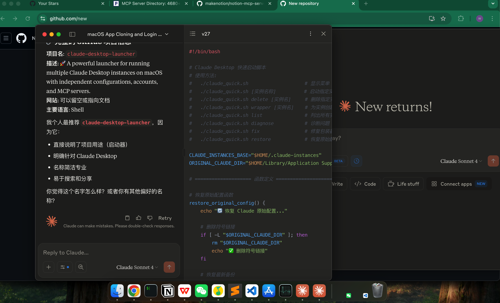
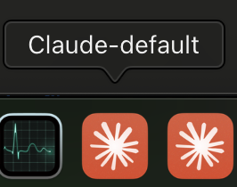

# Claude Desktop 多实例启动器

> 🚀 在 macOS 上同时运行多个 Claude Desktop 实例，每个实例独立配置、独立账户、独立 MCP 服务器设置

## 📸 效果展示

### 多窗口运行效果


### Dock 中的自定义显示名称
 

*在 Dock 中鼠标悬浮时，每个实例都会显示不同的自定义名称，而不是统一的 "Claude"*

## ✨ 功能特性

- 🔄 **多实例管理** - 在同一台机器上运行多个独立的 Claude Desktop 实例
- 🏷️ **自定义显示名称** - 在 Dock 中显示不同的应用名称（如 "Claude Work", "Claude Personal"）
- ⚙️ **独立配置** - 每个实例拥有独立的 MCP 服务器配置和登录信息
- 📱 **应用包装器** - 创建独立的应用图标，可直接从 Launchpad 启动
- 🛠️ **智能诊断** - 内置问题诊断和修复工具
- 💡 **简单易用** - 交互式菜单和命令行两种使用方式

## 📋 系统要求

- macOS 11 (Big Sur) 或更高版本
- Claude Desktop 应用（从 [claude.ai/download](https://claude.ai/download) 下载）
- Bash shell（macOS 内置）

## 🚀 快速开始

### 1. 下载和设置

```bash
# 克隆项目
git clone https://github.com/weidwonder/claude-desktop-multi-instance.git
cd claude-desktop-multi-instance

# 设置执行权限
chmod +x claude_quick.sh
```

或者直接下载脚本：

```bash
# 下载单个脚本文件
curl -O https://raw.githubusercontent.com/weidwonder/claude-desktop-multi-instance/main/claude_quick.sh
chmod +x claude_quick.sh
```

### 2. 第一次使用

```bash
# 运行脚本显示菜单
./claude_quick.sh

# 或直接创建并启动一个实例
./claude_quick.sh work
```

## 📖 使用说明

### 交互式菜单模式

运行 `./claude_quick.sh` 显示菜单：

```
======================================
    Claude Desktop 快速启动器
======================================

可用选项:
1. 启动默认实例
2. 选择现有实例
3. 创建新实例
4. 删除指定实例
5. 创建应用包装器 (独立图标)
6. 恢复原始配置
7. 诊断问题
8. 修复包装器
```

### 命令行模式

```bash
# 启动或创建实例
./claude_quick.sh [实例名称]

# 管理命令
./claude_quick.sh list                 # 列出所有实例
./claude_quick.sh delete [实例名]       # 删除实例
./claude_quick.sh wrapper [实例名]      # 创建应用包装器
./claude_quick.sh diagnose             # 诊断问题
./claude_quick.sh fix                  # 修复包装器
./claude_quick.sh restore              # 恢复原始配置
```

## 💼 使用场景

### 场景 1: 工作和个人账户分离

```bash
# 创建工作实例
./claude_quick.sh work
# 登录工作账户，配置工作相关的 MCP 服务器

# 创建个人实例
./claude_quick.sh personal
# 登录个人账户，配置个人 MCP 服务器
```

### 场景 2: 不同项目配置

```bash
# 项目 A - 包含文件系统和网络搜索 MCP
./claude_quick.sh project-a

# 项目 B - 包含数据库和 API MCP
./claude_quick.sh project-b

# 开发环境 - 包含 Git 和测试工具 MCP
./claude_quick.sh dev
```

### 场景 3: 创建应用包装器

```bash
# 为工作实例创建独立应用图标
./claude_quick.sh wrapper work
# 输入显示名称: Claude Work

# 现在可以从 Launchpad 直接启动 "Claude Work"
# 在 Dock 中会显示为 "Claude Work" 而不是 "Claude"
```

## 📁 文件结构

```
~/.claude-instances/                    # 实例数据目录
├── work/                              # 工作实例
│   └── Application Support/Claude/
│       └── claude_desktop_config.json
├── personal/                          # 个人实例
│   └── Application Support/Claude/
│       └── claude_desktop_config.json
└── scripts/                           # 辅助脚本
    ├── restore.sh                     # 快速恢复配置
    └── list.sh                        # 列出所有实例

/Applications/                          # 应用包装器
├── Claude.app                         # 原始应用
├── Claude-work.app                    # 工作实例包装器
└── Claude-personal.app                # 个人实例包装器
```

## 🔧 故障排除

### 问题：应用包装器无法启动

**解决方案：**
```bash
# 1. 运行诊断
./claude_quick.sh diagnose

# 2. 修复包装器
./claude_quick.sh fix

# 3. 如果仍有问题，重新创建
rm -rf /Applications/Claude-工作实例.app
./claude_quick.sh wrapper work
```

### 问题：找不到 Claude Desktop

**解决方案：**
1. 确保从 [claude.ai/download](https://claude.ai/download) 下载并正确安装 Claude Desktop
2. 确认应用位于 `/Applications/Claude.app`
3. 运行 `./claude_quick.sh diagnose` 检查安装状态

### 问题：实例配置丢失

**解决方案：**
```bash
# 恢复原始配置
./claude_quick.sh restore

# 检查备份文件
ls -la ~/Library/Application\ Support/Claude.backup.*
```

### 问题：图标显示异常

**解决方案：**
```bash
# 修复图标
./claude_quick.sh fix

# 或重新创建应用包装器
./claude_quick.sh wrapper [实例名]
```

## 📊 命令参考

| 命令 | 说明 | 示例 |
|------|------|------|
| `./claude_quick.sh` | 显示交互菜单 | `./claude_quick.sh` |
| `./claude_quick.sh [实例名]` | 启动或创建实例 | `./claude_quick.sh work` |
| `./claude_quick.sh list` | 列出所有实例 | `./claude_quick.sh list` |
| `./claude_quick.sh delete [实例名]` | 删除指定实例 | `./claude_quick.sh delete old` |
| `./claude_quick.sh wrapper [实例名]` | 创建应用包装器 | `./claude_quick.sh wrapper work` |
| `./claude_quick.sh diagnose` | 诊断问题 | `./claude_quick.sh diagnose` |
| `./claude_quick.sh fix` | 修复包装器 | `./claude_quick.sh fix` |
| `./claude_quick.sh restore` | 恢复原始配置 | `./claude_quick.sh restore` |

## 🔒 安全注意事项

1. **配置备份**：脚本会自动备份原始配置，但建议定期手动备份
2. **敏感信息**：每个实例的登录信息都是独立存储的
3. **权限控制**：应用包装器使用与原始 Claude 应用相同的权限
4. **数据隔离**：不同实例的数据完全隔离，不会相互影响

## ❓ 常见问题

**Q: 可以同时运行多个实例吗？**  
A: 不可以。macOS 限制同时只能运行一个 Claude Desktop 实例，但可以快速切换。

**Q: 实例之间的聊天记录会同步吗？**  
A: 不会。不同实例使用不同账户，聊天记录不会同步。

**Q: 如何备份实例配置？**  
A: 复制 `~/.claude-instances/[实例名]` 目录即可备份整个实例配置。

**Q: 可以导入/导出 MCP 配置吗？**  
A: 可以。复制 `claude_desktop_config.json` 文件即可在实例间共享 MCP 配置。

## 🤝 技术支持

如果遇到问题：

1. 首先运行 `./claude_quick.sh diagnose` 进行自动诊断
2. 检查本文档的故障排除部分
3. 确保 Claude Desktop 应用是最新版本
4. 检查 macOS 系统版本兼容性

## 📄 许可证

MIT License - 自由使用和修改

---

> 💡 **提示**: 这个工具特别适合需要同时管理多个 Claude 账户或不同 MCP 服务器配置的用户。每个实例都是完全独立的，可以安全地用于不同的工作环境。